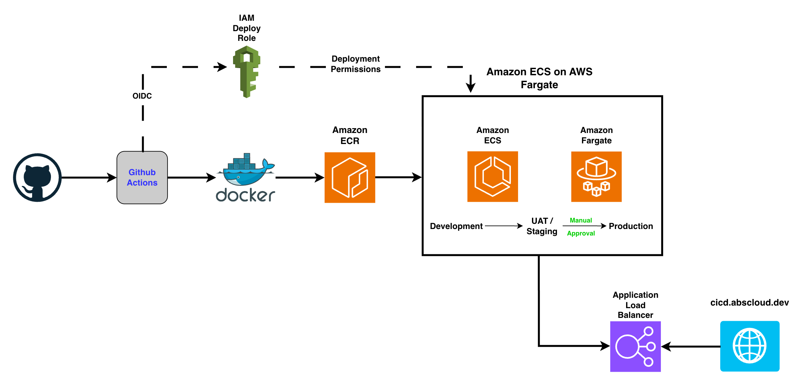

# AWS CI/CD & Containers Project

A containerised web application deployed to AWS through an automated CI/CD pipeline using GitHub Actions, Docker, Amazon ECR, Amazon ECS and AWS Fargate.

The project demonstrates automated build, validation and deployment, secure GitHub-to-AWS authentication with OIDC, environment promotion through Development → UAT/Staging → Production, and a manual Production approval gate.

## Architecture

### Deployment Flow

`GitHub → GitHub Actions → Docker → Amazon ECR → Amazon ECS/Fargate → Application Load Balancer`

Application changes progress through:

`Development → UAT/Staging → Manual Approval → Production`

## Core Technologies

- GitHub Actions — CI/CD automation
- Docker — application containerisation
- Amazon ECR — container image registry
- Amazon ECS — container orchestration
- AWS Fargate — serverless container compute
- Application Load Balancer — stable application endpoint
- AWS IAM + OIDC — secure GitHub-to-AWS authentication

## Implementation

The project was implemented in stages:

1. Containerise and test the application locally with Docker.
2. Store container images in Amazon ECR.
3. Deploy the application to Amazon ECS using AWS Fargate.
4. Build a GitHub Actions CI pipeline for validation and container testing.
5. Extend the workflow into automated CD.
6. Introduce Development, UAT/Staging and Production environments.
7. Add a manual approval gate before Production deployment.
8. Secure GitHub-to-AWS access using OIDC and least-privilege IAM permissions.
9. Route Production traffic through an Application Load Balancer.

## Evidence

Selected implementation evidence is documented here:

- [Project evidence](app/docs/evidence/README.md)
- [Troubleshooting evidence](app/docs/evidence/troubleshooting/README.md)
- [Architecture documentation](app/docs/architecture.md)
- [Environment setup](app/docs/environment-setup.md)

## Security

- GitHub Actions authenticates to AWS using OIDC rather than long-lived access keys.
- IAM trust is restricted to this repository, the `main` branch and the `production` environment.
- Deployment permissions are scoped to the ECR repository, ECS service and required execution role.
- ECS/Fargate accepts application traffic only from the Application Load Balancer security group.

## Cost Management

AWS Cost Explorer was reviewed during project completion. Current usage remained minimal, with small costs associated with ECR, ECS/Fargate, Elastic Load Balancing and related data transfer.

Chargeable runtime resources will be removed when they are no longer required.

## Key Learnings

- Building and testing container images with Docker.
- Automating CI/CD workflows with GitHub Actions.
- Publishing versioned container images to Amazon ECR.
- Deploying container workloads with ECS and AWS Fargate.
- Implementing Development → UAT/Staging → Production promotion.
- Using manual Production approval gates.
- Securing GitHub-to-AWS access using OIDC and least-privilege IAM.
- Troubleshooting CI validation, container architecture and OIDC trust failures.

## Project Status

The automated CI/CD pipeline, environment promotion workflow, Production approval gate, ECS/Fargate deployment and Application Load Balancer are operational.

HTTPS for `cicd.abscloud.dev` remains a non-blocking improvement. ACM DNS validation records were verified through the authoritative DNS server, Google DNS and Cloudflare DNS, but ACM remained in `PENDING_VALIDATION`.
