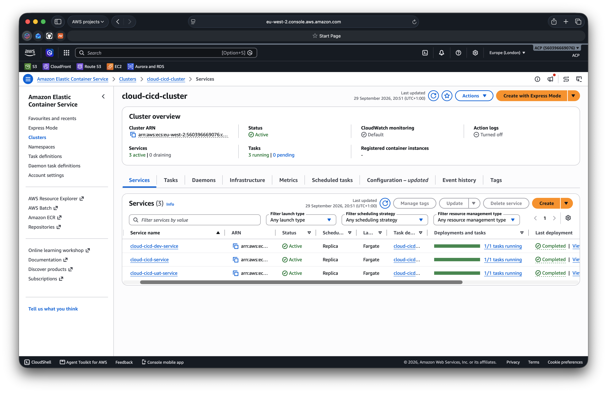
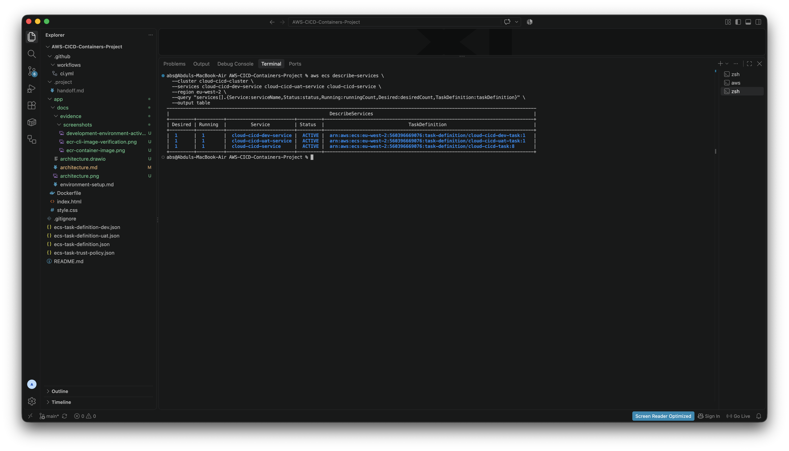
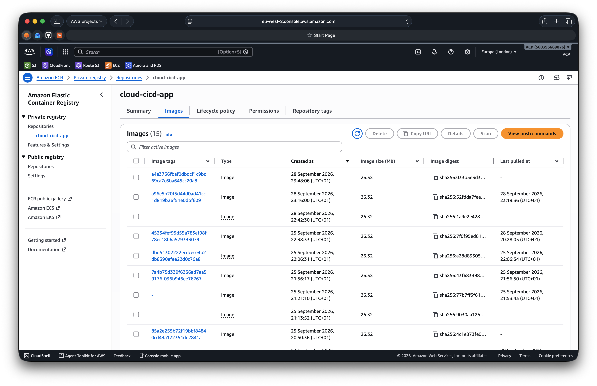
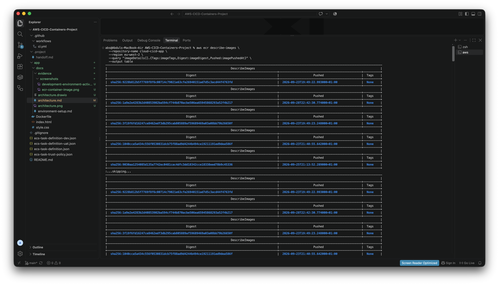
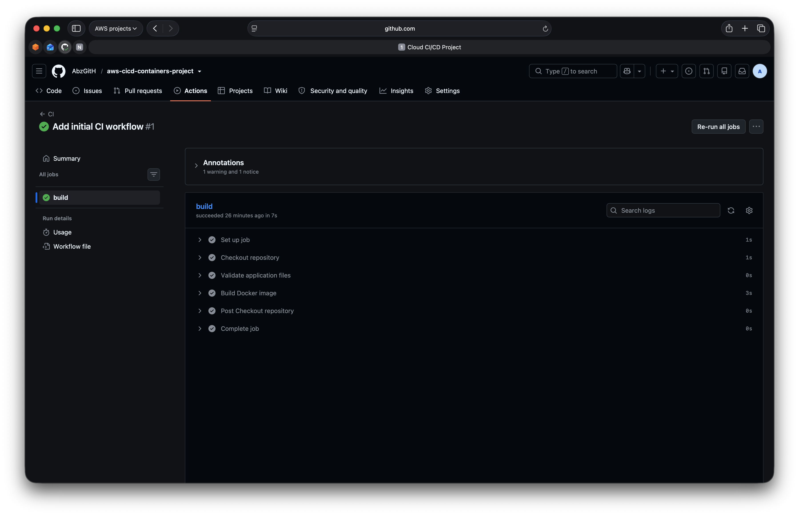
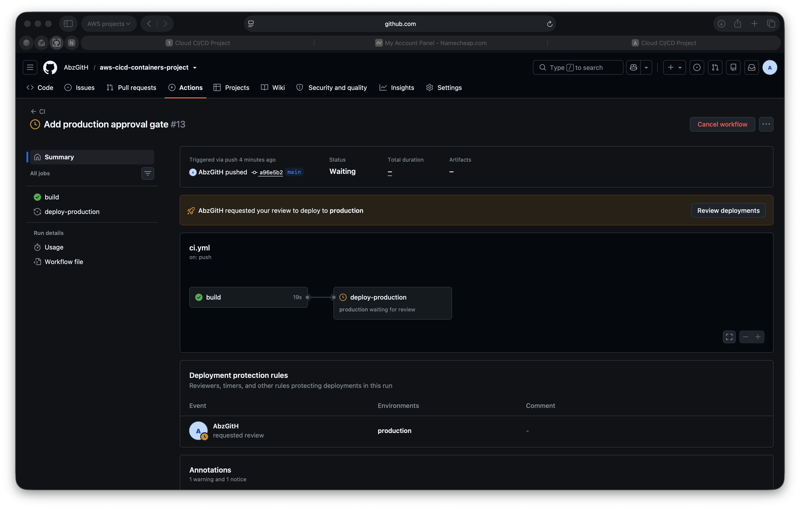
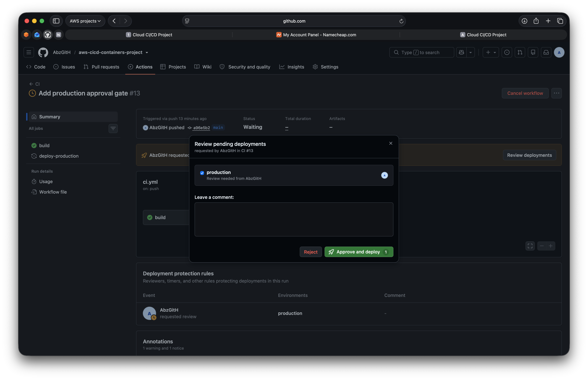
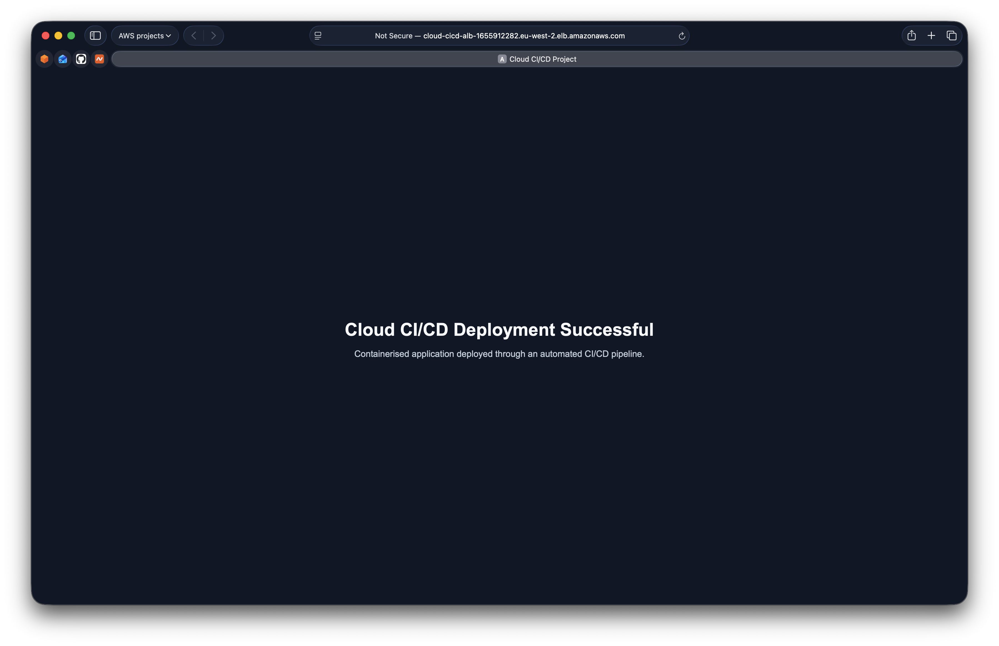

# Project Evidence

This folder contains selected evidence demonstrating the successful implementation of the CI/CD and container deployment workflow.

## ECS Environment Verification

**What it shows:**
Development, UAT/Staging and Production ECS services are active and running successfully, verified through both the AWS Console and AWS CLI.

**What it proves:**
The project implements separate deployment environments and confirms their healthy state through two independent verification methods.

## Amazon ECR Verification

The `cloud-cicd-app` Amazon ECR repository stores the container images produced by the CI/CD pipeline.

The AWS Console confirms that multiple container images were pushed successfully, with image tags, digests, creation timestamps and image sizes visible.

The AWS CLI independently confirms that the repository contains image records with digests and push timestamps.

**What this proves:**
The pipeline successfully publishes Docker images to Amazon ECR, where they are stored and made available for deployment to Amazon ECS/Fargate.

## CI/CD Automation

The GitHub Actions workflow completed the automated CI stages successfully, including checkout, validation, Docker image build and container testing.

The deployment pipeline paused at the Production environment and required manual approval before release.

The Production deployment review confirms that the release was explicitly approved before the deployment continued.

The deployed application was then verified successfully through the Production Application Load Balancer endpoint.

**What it proves:**
The project implements an automated CI/CD workflow that builds and validates the application, enforces a manual Production approval gate, deploys the approved release, and successfully serves the updated application in AWS.
