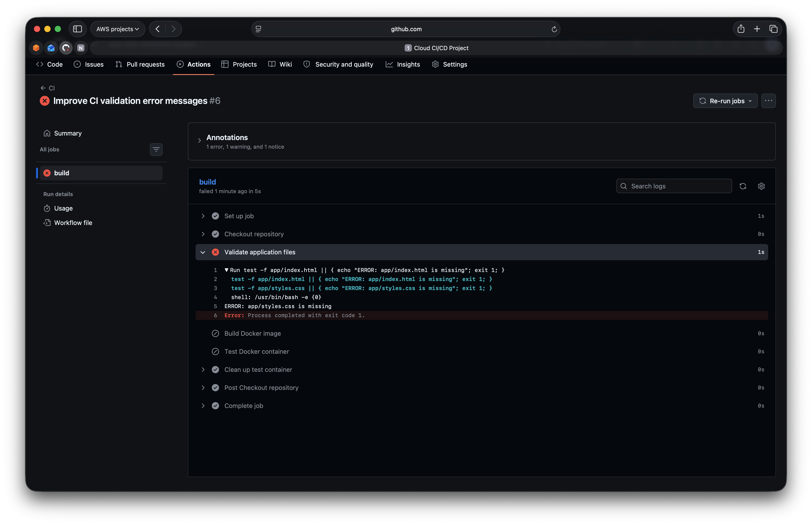
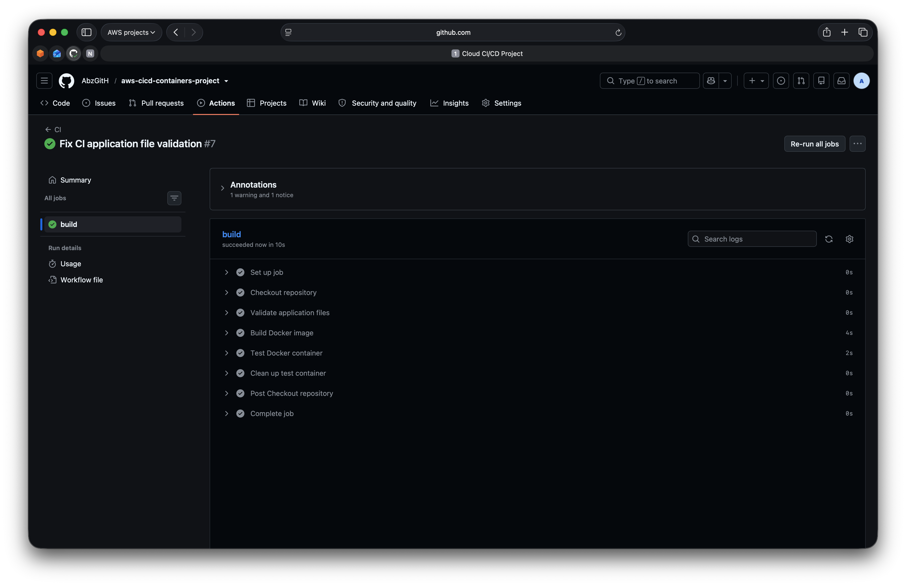
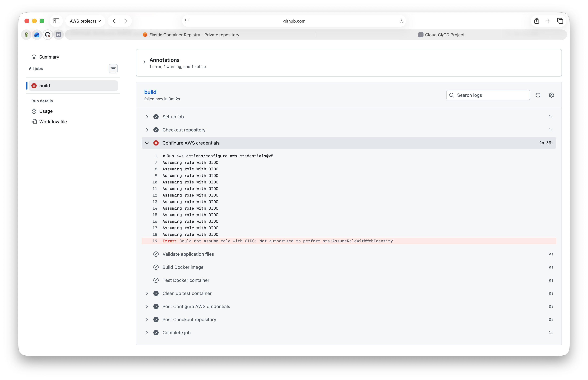
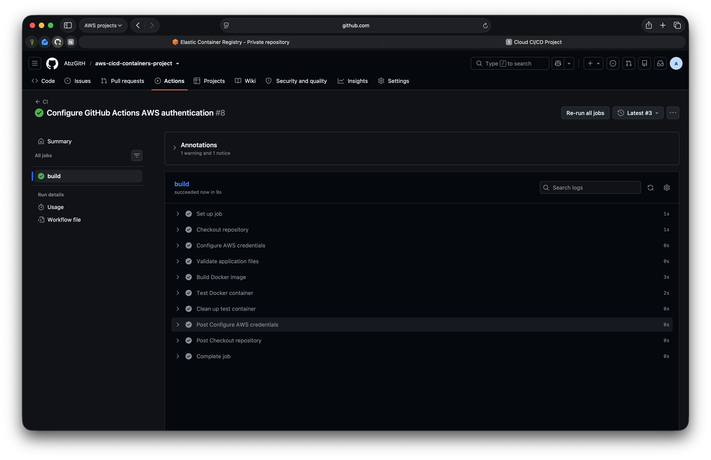
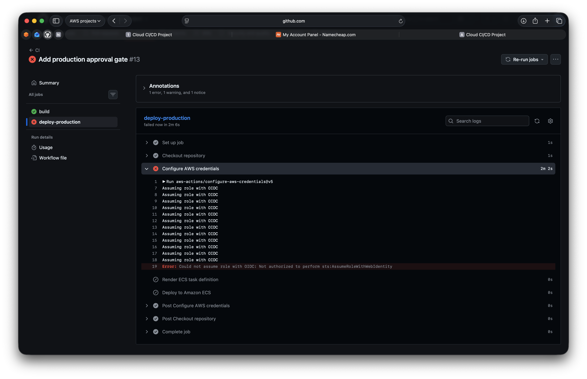
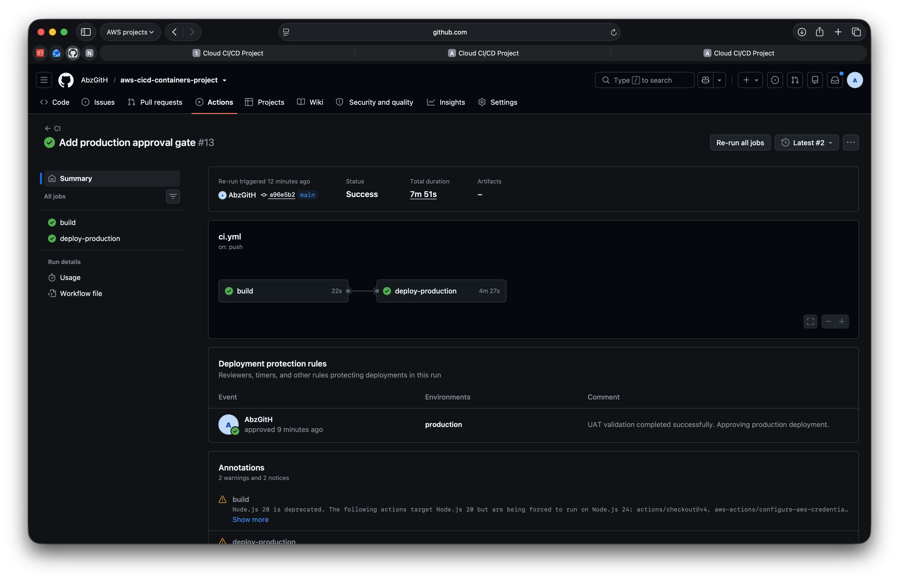

# Troubleshooting Evidence

This folder documents selected troubleshooting scenarios encountered during the project, showing the failure, diagnosis, corrective action, and successful recovery.

## CI Validation Failure and Recovery

The CI workflow was deliberately configured to validate a non-existent application file, causing the pipeline to fail during the validation stage with a clear error message.

**Diagnosis:**
The workflow was checking for `app/styles.css` instead of the correct `app/style.css`.

**Fix:**
The validation path was corrected so the workflow checked the actual application file.

**What it proves:**
The pipeline correctly blocks later build and test stages when validation fails, provides a readable diagnostic, and returns to a successful state once the configuration is corrected.

## GitHub Actions OIDC Authentication Failure and Recovery

The GitHub Actions workflow failed while attempting to assume the AWS deployment role through OIDC, returning an `sts:AssumeRoleWithWebIdentity` authorization error.

**Diagnosis:**
The AWS IAM trust relationship did not yet permit the exact GitHub Actions identity required by the workflow.

**Fix:**
The IAM trust policy was corrected so the GitHub repository and branch could assume the deployment role securely through OIDC.

**What it proves:**
GitHub Actions can authenticate to AWS without long-lived access keys once the IAM trust relationship is configured correctly.

## Production OIDC Environment Authorization Failure and Recovery

The Production deployment failed after the approval gate because the GitHub Actions job could no longer assume the AWS deployment role for the `production` environment.

**Diagnosis:**
Using the GitHub `production` environment changed the OIDC subject claim. The IAM trust policy needed to allow the Production environment identity as well as the branch-based identity.

**Fix:**
The IAM trust policy was updated to allow the Production environment OIDC subject while keeping the trust restricted to this repository.

**What it proves:**
The Production environment approval gate and AWS OIDC trust relationship work together correctly, allowing the approved release to continue through the automated deployment pipeline.
